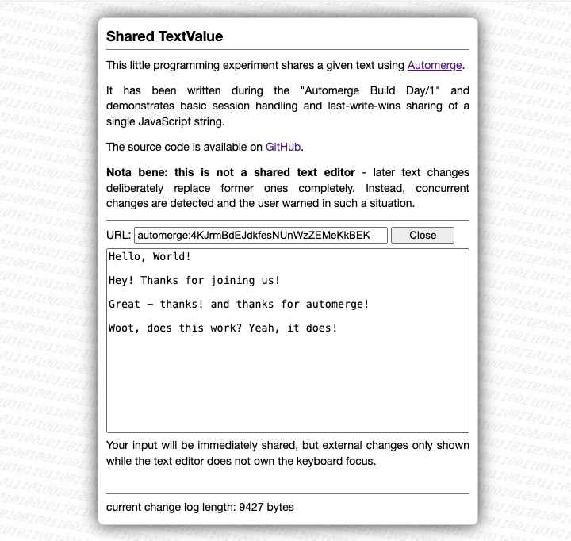

# sharedTextValue #

a small programming experiment for the Automerge Build Day/1 ([live demo](https://rozek.de/automerge/sharedTextValue.html))

The code takes care of the various steps needed to load automerge and either create a new or open an existing document.

Once ready, automerge is used to share a single string (the "TextValue") - but not like in a shared text editor (that will be the next step) but in an LWW fashion - taking care that when several people are working on the same text, key strokes on one side won't disturb the input on another side.

> An important detail worth mentioning: the experiment has not been built using Vite or another bundler but uses my [Automerge bundle](https://github.com/rozek/automerge-bundle) which allows you to use Automerge for plain script elements.

If you want to see a live demo, just navigate to [https://rozek.de/automerge/sharedTextValue.html](https://rozek.de/automerge/sharedTextValue.html). Open it twice in two browser windows and see how changes in one window affect the other one - and vice versa.

## License ##

[MIT License](LICENSE.md)
